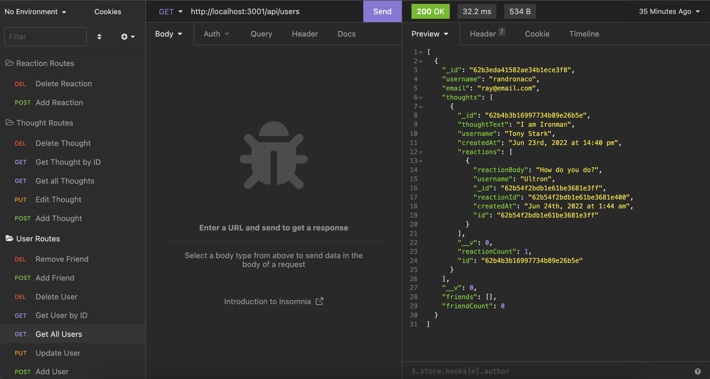
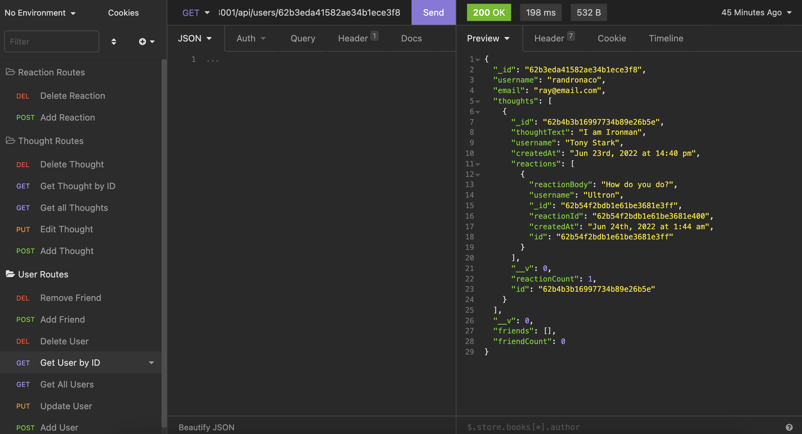
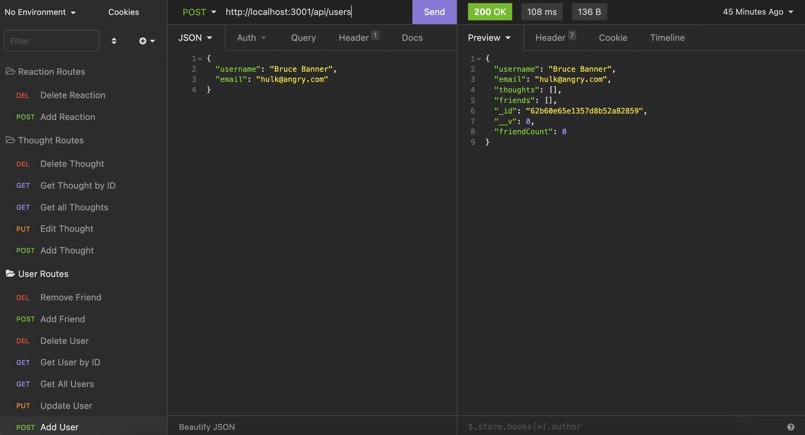
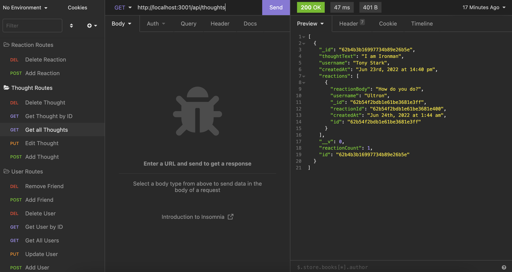

# social-network-api

## User Story
AS A social media startup

I WANT an API for my social network that uses a NoSQL database

SO THAT my website can handle large amounts of unstructured data

## Functionality

The user can start up the server by typing `npm start` in the command line.

In Insomnia, the user can view (GET) all users, view (GET) users by id, add (POST) a new user, edit (PUT) a user by id and delete (DELETE) a user.

The social network API has capabilities to add/view/edit/delete "thoughts" by user. These routes are accessed through POST/GET/PUT/DELETE routes, respectively.

The user can also add "reactions" to these thoughts and delete said reactions through POST and DELETE routes, respectively.

## Technologies Used
express

mongoose

## Preview of Application

## URLs

GitHub Repo: https://github.com/randronaco1027/social-network-api 

Start up server demo: https://drive.google.com/file/d/1BOEz4CT-cbgWyyFtJW0rEubEFrfcgY7k/view?usp=sharing 

User routes demo: https://drive.google.com/file/d/1tR4uzP0zI1gzElO38FmB9RF0uLnfi14i/view?usp=sharing 

Thought routes demo: https://drive.google.com/file/d/1sGQnyqeuqnf1eJ-D22RZQBjvLUmYJ1bL/view?usp=sharing 